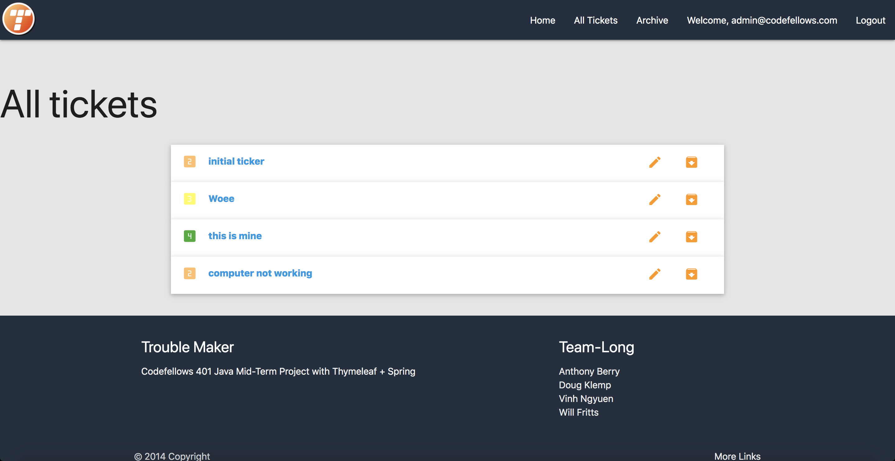
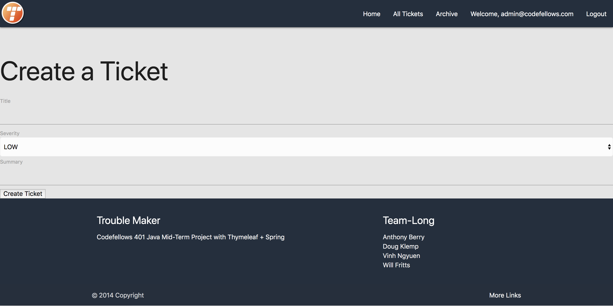
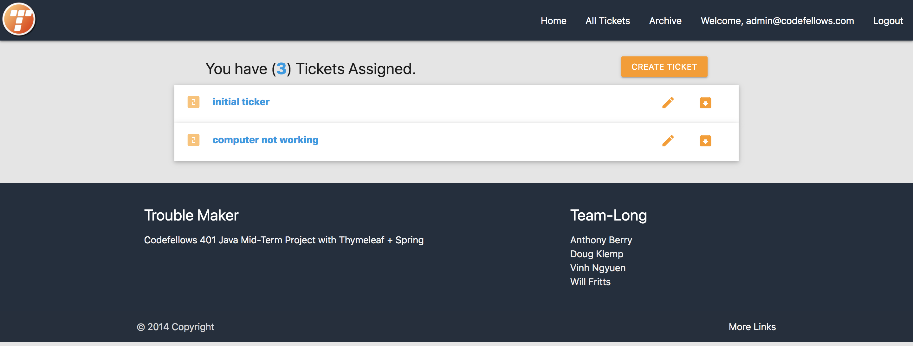

# Troublemaker

[Troublemaker](http://troublemaker.us-west-2.elasticbeanstalk.com/)

## Description

This application is a trouble ticket management system.

Currently, the application divides users into two roles: admin and user.

Upon creating an account, users can log in and are allow to create and edit a Trouble ticker, which will notify admin users via email.
Users can add updates to the ticket by adding comments attached to the ticket.

Admins can view all trouble tickets submitted, edit, add updates, and resolve any ticket as well as archive it once it has been resolved.

## Visual Description





## Technology Stack

Language: Java 8
IDE: IntelliJ
Framework: Spring including Spring Security for Authentication and Authorization, Thymeleaf
Build Tool: Gradle
Email Sender: AWS SES
Deployment: AWS Elastic Beanstalk
Database: PostgreSQL with AWS RDS as host

## Team Long Members

[William Fritts](https://github.com/wafman)

[Doug Klemp](https://github.com/idothestamping)

[Vinh Nguyen](https://github.com/nguyenvinh2)

[Anthony Berry](https://github.com/Antberry)

## Problem Domain
- Keeping track of our trouble ticket history.
- not allowed to edit trouble tickets after being created.
- admin do not complete tickets in a timely manner.
- admin do not know which order to complete tickets.

## Solution
- Application allow users to create tickets.
- Application allow users to edit tickets.
- Application allow admin to store all tickets in an archive.
- Application allows users to see open tickets.
- Application notify admin by email when a ticket has been created.
- Application allow users to select severity level of the ticket.


## DEMO
- [Trouble Maker](http://troublemaker.us-west-2.elasticbeanstalk.com/login)

## Test
- [TEST](./src/test/java/com/teamLong/java401d/midterm/troublemaker/TroublemakerApplicationTests.java)

## Work Flow and Process
- Ensure Database was connected to the Application
- Login Authentication
- Logic for the Models/Controllers
- Deploy to AWS

## Success
- Success completed the application we wanted to build
- Complete 90% of stretch goals.

## Growth
- Managing our priorities as far as Features and Stretch Goals.

## API
- ```@RequestMapping(value = "/", method = RequestMethod.GET)```
    - Give you the main page.
- ```@RequestMapping(value = "/user", method = RequestMethod.GET)```
    - Give you the user page.
- ```@RequestMapping(value = "/admin", method = RequestMethod.GET)```
    - Give you the admin page.
- ```@GetMapping("/tickets/all")```
    - Give you a list of all Tickets.
- ```@GetMapping("/ticket/{ticketId}")```
    - Give you a detailed page for one ticket.
- ```@PostMapping("/create/ticket")```
    - Give you the create a ticket page.
- ```@GetMapping("/edit/{id}")```
    - Give you the edit ticket page.
- ```@DeleteMapping("delete/ticket/{id}")```
    - Deletes a ticket from Ticket page.
- ```@RequestMapping(value = "/register", method = RequestMethod.GET)```
    - Give you the Register page.

## Directions

Git clone this repository.

This project requires the following:

    A connection to a PostgreSQL database.

    set you ENV variables in your application settings to
    the following variables:

        DATABASE_URL: jdbc:postgresql://youdatabaseconnection
        PSQL_USERNAME: your username to Postgres
        PSQL_PASSWORD: youur Postgres database password
        AWS Simple Email Service requires AWS Credentials.

Note: This application uses SES in "Sandbox Mode", which can only send email w/ verified email addresses.

To run the application:

- from Intellij
    - open application
    - run Troublemakerapplication
- from command line
    - TEST
        - ```./gradlew test```
    - start server
        - ``` ./gradlew bootRun```
- deployed
    - [Trouble Maker](http://troublemaker.us-west-2.elasticbeanstalk.com/login)

## Acknowledgments
- Geekforgeeks.com
- bootstrap.com
- stackoverflow.com
- W3schools.com


